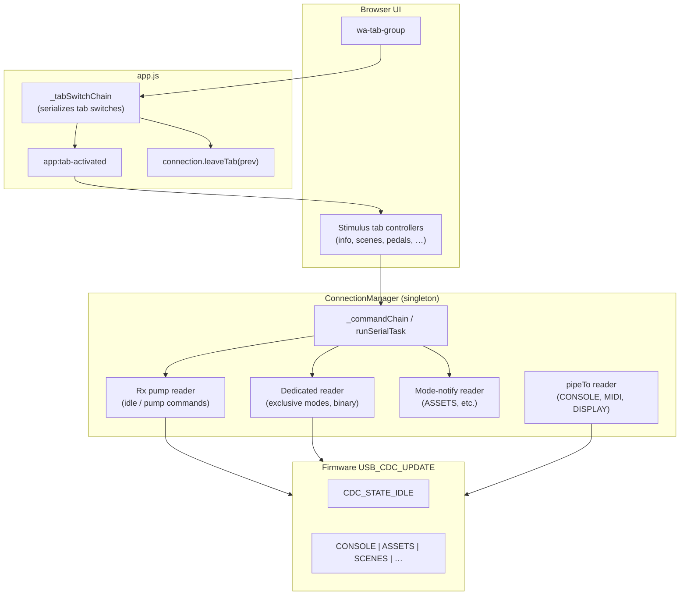

# Web Serial, Tabs, and USB CDC

This document describes how the Storm Summoner web configurator shares one WebSerial port across many UI tabs without deadlocks, reader contention, or stale command collisions. It is the reference for adding new tabs or new CDC interactions.

**Related firmware / protocol docs:**

- `components/usb_cdc_update/usb_cdc_update.c` — CDC state machine and command dispatch
- [SETTINGS_PROTOCOL.md](SETTINGS_PROTOCOL.md) — CONFIG mode (semantic settings)
- [USB_CDC_BINARY_TRANSFER.md](USB_CDC_BINARY_TRANSFER.md) — `SIZE` + binary payloads (ASSETS, SCENE_GET, …)
- [USB_COMPOSITE.md](USB_COMPOSITE.md) — USB layout

---

## The core constraint

Chromium WebSerial exposes **one readable stream** per port. Only **one** `ReadableStreamDefaultReader` may hold the lock at a time. The firmware side (`USB_CDC_UPDATE`) also assumes **one active CDC mode** at a time (CONSOLE, ASSETS, SCENES, …).

The web app therefore enforces:

1. **One serial task at a time** — all port I/O goes through a global queue.
2. **Explicit mode entry and exit** — match the firmware `cdc_update_state_t` before sending mode-specific commands.
3. **Tab lifecycle cleanup** — leaving a tab must release modes and readers the tab acquired.
4. **Stale-work suppression** — activations enqueued during rapid tab switching must bail out if the user has already moved on.

Violating (1) produces `Serial reader busy`, corrupted banner reads, and `(no response)` timeouts. Violating (2) produces firmware warnings like `Unknown command: LIST`. Violating (3) leaves the device stuck in a mode the UI no longer reflects. Violating (4) produces errors that **trickle in seconds or minutes after** the user stopped clicking.

---

## Architecture overview



---

## ConnectionManager (`web/js/app.js`)

`ConnectionManager` is a singleton. Every Stimulus controller inherits `this.connection` from `BaseController`.

### Serial task queue

All top-level port work is serialized through `_commandChain`:

```javascript
runSerialTask(fn)           // explicit enqueue
requestMode(mode)           // enqueues _requestModeImpl
exitMode()                    // enqueues _exitModeImpl
sendCommand(cmd)              // enqueues _sendCommandImpl
readLine(timeout)             // enqueues _readLineBody
fetchSizedTransfer(cmd)       // enqueues _fetchSizedTransferImpl
recoverSerialState()          // enqueues _recoverSerialStateImpl
```

**Rule — public helpers vs private impl:**

| Caller context | What to call |
|----------------|--------------|
| Outside any `runSerialTask` body (tab handler, button click, `catch` block, fire-and-forget leave) | Public helpers above, or `runSerialTask(() => …)` |
| Inside a `runSerialTask` body (including nested helpers like `ensureAssetsModeBody`) | Private `_*Impl` / `_*Body` methods only |

Calling a **public** helper from **inside** a task body enqueues behind the task that is already running → **deadlock**.

There is **no** “nested bypass” based on `_serialDepth` or `isSerialBusy`. Do not use `isSerialBusy` to decide whether to enqueue; that reintroduces concurrent port access when another tab’s task is mid-`await`.

### Client mode tracking

| Field | Meaning |
|-------|---------|
| `connection.mode` | Client-side mode flag: `ASSETS`, `CONSOLE`, `MIDI`, `DISPLAY`, `UPDATE`, `PEDALS`, or `null` |
| `connection._deviceScenesActive` | Device is in `CDC_STATE_SCENES` while client keeps `mode === null` so SCENE_INSPECT / SCENE_GET can use the rx pump |

The Scenes tab deliberately **does not** call `requestMode('SCENES')`. It sends `SCENES\n` with `mode === null`, sets `_deviceScenesActive`, and reads lines through the pump. See `_prepareScenesClientMode()` and `scenes.js` `enterScenesMode()`.

`ensureDeviceIdle()` is the canonical “get back to idle” helper:

- If `mode` or `_deviceScenesActive` is set → `_exitModeImpl()` (waits for `*_STOPPED` banner when applicable).
- If already idle on the client → sends bare `EXIT\n` (firmware ignores it in idle), clears RX buffers, re-arms pump.

**Do not** wait for a stop banner when the client is already idle — the firmware sends nothing.

### Reader roles

WebSerial allows one reader. The app multiplexes by **suspending** other consumers:

| Reader | Active when | Used for |
|--------|-------------|----------|
| **Rx pump** | `mode === null`, pump not suspended | `INFO`, `DEVICE`, `SCENE_INSPECT`, idle `EXIT`, banner waits via `_readPumpLineBody` |
| **Dedicated reader** | Exclusive serial task, pump suspended | `sendCommand`, `fetchSizedTransfer`, ASSETS line phase, banner reads in exclusive modes |
| **Mode-notify reader** | `mode !== null` (except scenes client trick) | Async `EVT:` / firmware notifications while in ASSETS-like modes |
| **`pipeTo` reader** | CONSOLE, MIDI, DISPLAY tabs | Streaming relay; separate from pump; must be torn down in tab leave handler |

`_acquireDedicatedReader()` retries if the stream is locked; failure throws **`Serial reader busy`**.

`beginExclusiveSession()` / `endExclusiveSession()` — used by Pedals (and similar) to suppress mode-notify while a multi-step ASSETS transaction runs inside one task.

### Recovery

`recoverSerialState()` — queued reset: release all readers, send `EXIT`, clear mode flags, restart pump. Use from **outside** task bodies (e.g. activation `catch`). It must not be called from inside a running task without using `_recoverSerialStateImpl()` directly (rare).

---

## Tab lifecycle

### Switch sequence (`app.js`)

Tab clicks are serialized on `_tabSwitchChain`:

1. `leaveTab(previousPanel)` — runs registered leave handler for the tab being left.
2. `document.dispatchEvent('app:tab-activated', { tab: newPanel })` — every controller listens; the **new** tab activates, others may leave modes.

Leave handlers are registered with:

```javascript
this.connection.registerTabLeaveHandler('midi', () => this.deactivate())
```

**Prefer `registerTabLeaveHandler` for cleanup that must complete before the new tab activates.** Some controllers also listen for `app:tab-activated` on the *incoming* tab name to call `leaveX()` — that runs **after** the new tab’s activate handler (DOM order), which can race; leave handlers are safer for releasing modes.

### `BaseController.isTabActive(panelName)`

Returns whether the given panel is the active `wa-tab`. Use this (plus a generation counter) to **skip stale activations** that were enqueued before the user switched away.

Pattern (see `info.js`, `pedals.js`, `midi.js`):

```javascript
this._activateGeneration++
const gen = this._activateGeneration

await this.connection.runSerialTask(async () => {
  if (gen !== this._activateGeneration || !this.isTabActive('pedals')) return
  // … device I/O …
})
```

On deactivate / tab leave, bump the generation so in-flight work exits quietly (no `console.error` for abandoned work).

### Events

| Event | When | Typical use |
|-------|------|-------------|
| `app:tab-activated` | After leave handler for previous tab | Enter mode, fetch data |
| `app:tab-params` | Programmatic navigation with params | Deep-link into Pedals slug, etc. |
| `connection:changed` | Connect / disconnect | Reset UI, pending flags |
| `mode:changed` | Client `mode` updated | Clear tab-local `inXMode` flags |
| `cdc:notify` | Firmware `EVT:` lines | Scenes list refresh debounce |

---

## Firmware CDC modes (summary)

Firmware state enum (`usb_cdc_update.c`): `IDLE`, `CONSOLE`, `ASSETS`, `DISPLAY`, `MIDI_RELAY`, `SETTINGS`, `CONFIG`, `SCENES`, `PEDALS`, plus transient receive/send states for updates and binary transfers.

### Mode entry (idle → mode)

Sent from idle via `process_command()`:

| Command | Banner | Firmware state |
|---------|--------|----------------|
| `ASSETS` | `ASSETS_STARTED` | `CDC_STATE_ASSETS` |
| `CONSOLE` | `CONSOLE_STARTED` | `CDC_STATE_CONSOLE` |
| `DISPLAY` | `DISPLAY_STARTED` | `CDC_STATE_DISPLAY` |
| `MIDI` / `MIDI CLOCK` | `MIDI_STARTED` | `CDC_STATE_MIDI_RELAY` |
| `SETTINGS` | `SETTINGS_STARTED` | `CDC_STATE_SETTINGS` |
| `CONFIG` | `CONFIG_STARTED` | `CDC_STATE_CONFIG` |
| `SCENES` | `SCENES_STARTED` | `CDC_STATE_SCENES` |
| `PEDALS` | `PEDALS_STARTED` | `CDC_STATE_PEDALS` |

`EXIT` from a mode → `*_STOPPED` banner (except bare `EXIT` in idle — silently ignored).

### Idle-only commands (examples)

These are handled in `process_command()` **only when** `s_state == CDC_STATE_IDLE`:

- `INFO`, `DEVICE`, `SCENE_GET`, `SCENE_PUT`, `SCENE_INSPECT`, `SYNC`, update verbs, etc.

If a mode-specific command arrives in idle, firmware logs:

```text
W (…) USB_CDC_UPDATE: Unknown command: <cmd>
```

and responds `ERROR: Unknown command`.

### Mode-specific commands (examples)

| Mode | Example commands | **Not** valid in idle |
|------|------------------|------------------------|
| SCENES | `LIST`, `CREATE`, `GOTO`, `REORDER`, … | `LIST` |
| SETTINGS | `LIST`, `GET`, `SET`, `DUMP`, … | `LIST`, `DUMP` |
| CONFIG | `VALUES`, `SET`, `COUNT`, … | `VALUES` |
| ASSETS | `LS`, `GET`, `PUT`, `MANIFEST`, `ZIP`, … | `LS` |
| CONSOLE | (interactive — forwarded to ESP log / CLI) | — |

Always enter the mode **immediately before** sending its subcommands in the **same serial task**, unless you have just verified the device is still in that mode.

---

## Existing tabs (reference)

| Tab | JS controller | Device mode | Client `mode` | Leave handler | Notes |
|-----|---------------|-------------|---------------|---------------|-------|
| Info | `info.js` | idle | `null` | — | `INFO` via pump; generation guard |
| Scenes | `scenes.js` + `scene.js` | SCENES | `null` + `_deviceScenesActive` | `leaveScenesModeFully` | `SCENES` + `LIST`; inspect uses pump + `SCENE_GET` |
| Pedals | `pedals.js` | ASSETS | `ASSETS` | `leaveAssetsMode` on tab change | Manifests via `fetchSizedTransfer`; generation guard |
| Assets | `assets.js` | ASSETS | `ASSETS` | `leaveAssetsMode` | File browser; `setTabsLocked` on upload |
| Console | `console.js` | CONSOLE | `CONSOLE` | `deactivate` | `requestMode` + `pipeTo` read loop |
| MIDI | `midi.js` | MIDI_RELAY | `MIDI` | `deactivate` | WebMIDI out + CDC in relay; `_relayGeneration` |
| Display | `display.js` | DISPLAY | `DISPLAY` | `deactivate` | Binary LVGL stream |
| Updater | `updater.js` | UPDATE / binary | `UPDATE` | — | Own reader for progress; locks tabs |
| Settings | `settings.js` | SETTINGS | local flag only | `leaveSettingsMode` on tab change | NVS `DUMP` / `SET` |
| Config (NVS UI) | `config.js` | CONFIG | local flag; pump for session | `leaveConfigMode` on tab change | Schema-driven `VALUES` |

---

## Adding a new tab — checklist

### 1. Decide the CDC interaction model

- **Idle pump commands** (like Info, SCENE_INSPECT): keep `mode === null`; use `_sendCommandViaPump`, `_readPumpLineBody`, `_waitForSerialBanner`.
- **Exclusive text mode** (like CONFIG, SCENES list): enter with `sendRaw('FOO\n')`, wait for `FOO_STARTED`, use dedicated reader or pump per existing tab pattern.
- **Streaming mode** (like CONSOLE/MIDI/DISPLAY): `requestMode`, dedicated `pipeTo` loop, **`registerTabLeaveHandler`** must stop the loop and `exitMode`.
- **Binary transfer** (like ASSETS GET): `fetchSizedTransfer` / `_fetchSizedTransferImpl`; see [USB_CDC_BINARY_TRANSFER.md](USB_CDC_BINARY_TRANSFER.md).

### 2. Wire tab lifecycle

```javascript
connect () {
  document.addEventListener('app:tab-activated', e => {
    if (e.detail.tab === 'mytab' && this.connection.isConnected) {
      this.activate()
    }
  })
  this.connection.registerTabLeaveHandler('mytab', () => this.deactivate())
}
```

### 3. Implement activate / deactivate

- **`activate()`**: bump generation; enqueue **one** `runSerialTask` that enters mode and loads data.
- **`deactivate()`**: bump generation; enqueue cleanup (`_exitModeImpl` or tab-specific leave); stop any local read loops.
- Guard every `await` boundary: if `!this.isTabActive('mytab')` or generation stale → return without logging errors.

### 4. Use the correct API layer

Inside the task body:

```javascript
await this.connection.runSerialTask(async () => {
  await this.connection.ensureDeviceIdle()
  await this.connection.sendRaw('MYMODE\n')
  const banner = await this.connection._waitForSerialBanner('MYMODE_STARTED', 5000)
  // …
  const line = await this.connection._readLineBody(5000)
  // or
  const { data } = await this.connection._fetchSizedTransferImpl('GET /path')
})
```

Outside the task body:

```javascript
await this.connection.exitMode()  // safe — enqueues
```

### 5. Long operations

Call `this.connection.setTabsLocked(true, 'mytab')` during multi-second uploads so the user cannot switch into another tab that fights for the port. Always unlock in `finally`.

### 6. Firmware counterpart

Add mode to `usb_cdc_update.c`: state enum, `process_mymode_command()`, entry command in idle dispatcher, `EXIT` → `MYMODE_STOPPED`. Document protocol in `docs/` if non-trivial.

---

## Common failure modes

### `Serial reader busy`

Two code paths tried to `getReader()` at once — often a tab leave handler did not await reader release, or a task bypassed the queue (historical bug). **Fix:** ensure all port access is queued; leave handlers must await teardown.

### Wrong banner / `(no response)` / `Timeout waiting for FOO_STARTED (got: BAR_STARTED)`

Usually a **stale task** ran while the device was in a different mode, or two tasks interleaved before queue enforcement. **Fix:** generation + `isTabActive` guards; do not fire-and-forget mode entry.

### Errors trickling in 10–30 s after tab switches stop

Backlog of queued `runSerialTask` activations from rapid clicking, each hitting timeouts. UI looks fine on the final tab; stale tasks still drain. **Fix:** stale guards; optionally coalesce duplicate activations (like Info’s `_activatePending`).

### `W USB_CDC_UPDATE: Unknown command: LIST`

`LIST` is valid in **SCENES** and **SETTINGS** modes only. This warning means `LIST\n` reached the firmware while **`CDC_STATE_IDLE`**.

Typical causes:

1. **Stale scenes work** — a task sent `SCENES\n` and got `SCENES_STARTED`, then a **later queued task** sent `EXIT\n` (leave handler, `ensureDeviceIdle`, another tab’s activate), then the first task continued with `LIST\n`.
2. **Missing mode entry** — `LIST\n` sent without a successful `SCENES\n` / `SETTINGS\n` in the same task.
3. **Dead path** — `scene.js` `fetchSceneListInTask()` sends `SCENES` + `LIST` but is currently unused; if revived, it must run inside `runSerialTask` with proper guards.

Harmless if transient during development/testing; repeated warnings after idle indicate a lifecycle bug worth fixing.

### Uncaught `pipeTo` rejection

CONSOLE/MIDI teardown cancels the readable stream. Attach `.catch(() => {})` to the `pipeTo` promise (see `midi.js`, `console.js`).

### `ensureDeviceIdle` while another tab already entered a mode

`scenes.js` `leaveScenesModeFully` intentionally **skips** forced idle if `currentMode` is already something other than `SCENES` — the new tab owns the session. New leave handlers should follow the same pattern: don’t `EXIT` a mode you didn’t enter.

---

## Anti-patterns (do not)

1. **`if (connection.isSerialBusy) await impl(); else await runSerialTask(impl)`** — runs concurrently with an unrelated in-flight task.
2. **Public `readLine()` / `exitMode()` inside a `runSerialTask` body** — deadlocks.
3. **Fire-and-forget `leaveAssetsMode()` without caring about ordering** — OK only because `exitMode()` enqueues; still prefer leave handlers for ordering vs activate.
4. **Background `setInterval` polling without tab guard** — must check active panel (see `scene.js` programming poll pattern).
5. **Assuming client `mode === null` means device is idle** — check `_deviceScenesActive`.
6. **Sending mode subcommands from idle** — firmware `Unknown command` + host mis-parsed responses.
7. **Awaiting child work inside `runSerialTask` when the child enqueues its own task** — deadlock. `openSceneDispatch` must release the lock before dispatching `scenes:open-scene` (the panel calls `runSerialTask` for SCENE_INSPECT / SCENE_GET).

---

## File index (web)

| File | Role |
|------|------|
| `web/js/app.js` | `ConnectionManager`, queue, readers, tab switch chain, `BaseController` |
| `web/js/info.js` | Reference activate / generation pattern |
| `web/js/scenes.js` | SCENES mode, `LIST`, leave handler nuance |
| `web/js/scene.js` | Scene editor, pump commands, inspect loads |
| `web/js/pedals.js` / `assets.js` | ASSETS mode, manifests, exclusive session |
| `web/js/console.js` / `midi.js` / `display.js` | Streaming modes + `pipeTo` |
| `web/js/settings.js` / `config.js` | SETTINGS / CONFIG modes |
| `web/js/pedal_catalog.js` | Shared ASSETS helpers (`ensureAssetsReady`, manifests) |

---

## Quick debugging

1. **Browser console** — activation errors include stack traces; note `app.js:run` / `runSerialTask` frame.
2. **Firmware monitor** — `USB_CDC_UPDATE` warnings show commands received in wrong state.
3. **Check queue depth indirectly** — if errors arrive late, suspect stale queued tasks, not live contention.
4. **Verify active tab** — `document.querySelector('wa-tab-group wa-tab[active]')?.getAttribute('panel')`.
5. **Verify client state** — `connection.currentMode`, `connection._deviceScenesActive`, `connection.isSerialBusy`.

When in doubt: one serial task, enter mode, do work, exit mode, guard for stale tab — same task, no gaps for other tasks to `EXIT` between entry and subcommands unless intentional.
